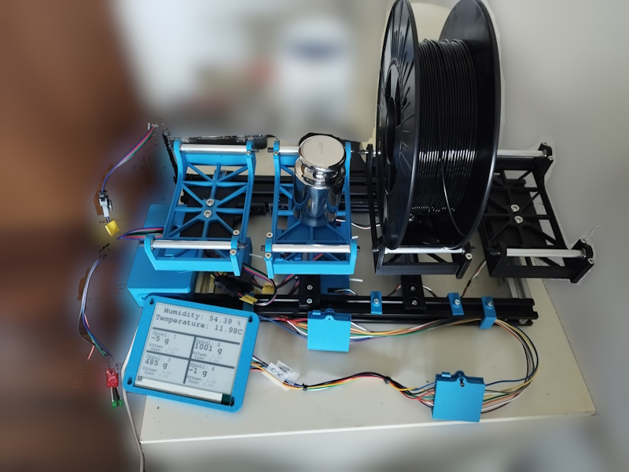
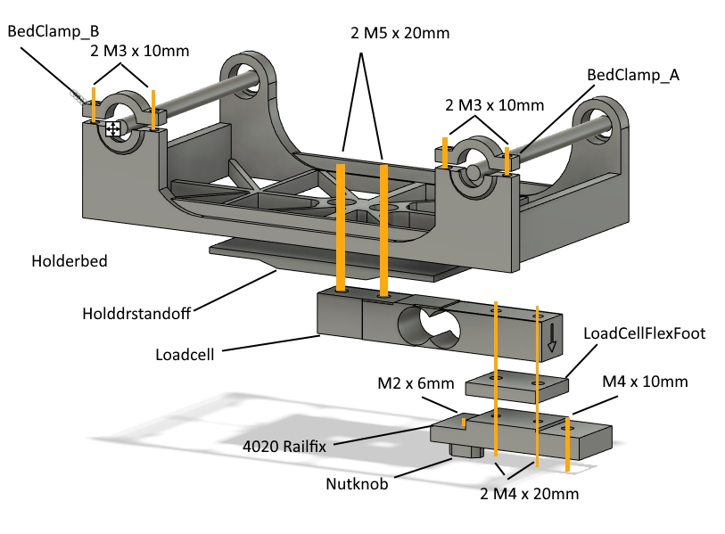
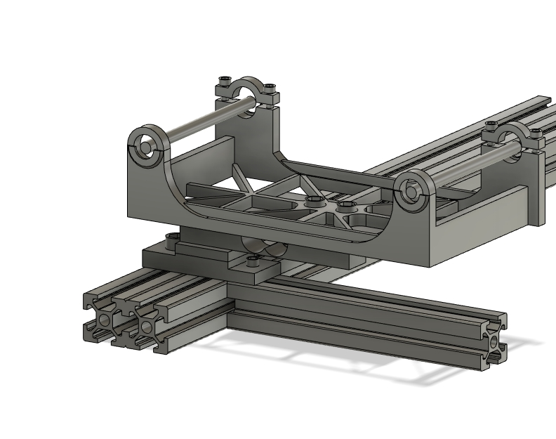
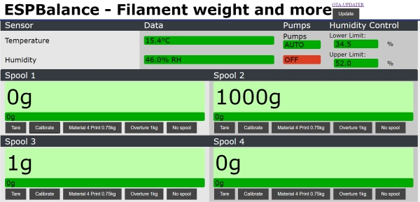

# Totally-over-engineered-filament-spool-balance

## What it can and (hopefully soon) does

- Spool holder for 4 filament spools
- Each with a load cell to record the weight
- Temperature and humidity measurement
  - BME280 sensor
  - EEPROM saved control range (Lower and Upper level)
  - Switching of 2 digital GPIOs (Switching ON if > upper level, OFF is < lower level) I use for pumping air through a dehumidifier
- WiFi connection to my home network
- OTA (Over the air) update of the firmware
- Publishing the data to my MQTT server
- Waveshare 4.2Inch e-Paper module to show the data directly on the filament box
- Easy web frontend to 
  - Show all the data (weight, set spool weights, temperature, humidity, upper and lower humidity level)
  - Set upper and lower control range
  - Switch the pumps automatic on/off
  - Switch the pumps on/off
  - Tare each balance
  - Calibrate each balance (1000g calibration weight)
  - set the spool type between 
    - Material4Print-750g spools
    - Overture 1000g spools (A friend gave me a spool of TPU, normally I only use M4P)

## Background
I have a 3D printer and a filament storage box which keeps the filament dry. The printer is fed directly out of the box.

Filament box is on top of an IKEA Lack table, below the printer. A hole drilled through the filament box and the 5cm "wook" of the lack, lined with a PTFE tube allows me to do so.

The filament spool is on a holder with an integrated load cell which gives me the weight of the spool to not have to guess whether the filament is sufficients for the print or not.

That's working and I could be happy.

Yeah, could.

But....
I do often switch between filaments, which mean I have to not only unload the filament from the 3D printer, but also pull it back into the box, enter the new filament through the PFTE liner, place the spool on the balance, record the weight of the empty spool (I only have 2 manufacturers material, so that's not difficult), enter it into my system.
But that means the filament box is open for a minute or so, has air exchange with the room, humidity increases...

## Hardware

The 3D printed parts I used can be sound in the hardware/stls directory.

Beside of the 3D printed part (and a few screws and wires) I used the following things:
- 16 685ZZ beatings
- 8 x  90mm pieces of M5 thread
- 8 x  70mm alu pipe ID:5mm , 1mm wall thickness
- 4 12.7x12.7x80mm 3kg load cells with HX711 boards
- A Lolin S3 ESP32 S3 dev board
- A Waveshare 4.2inch e-Paper-module (I bought some years ago)
- A BME280 sensor breakout board
- Aluminium extrusion
  - 4 x 120mm 2020
  - 1 x 330mm 2020 
  - 1 x 400mm 2040
  - Corner connectors and t-nuts

Tools I used
- electric screwdriver
- M3 screw tap
- allen keys

### And that's the frontend, ugly, isn't it?
